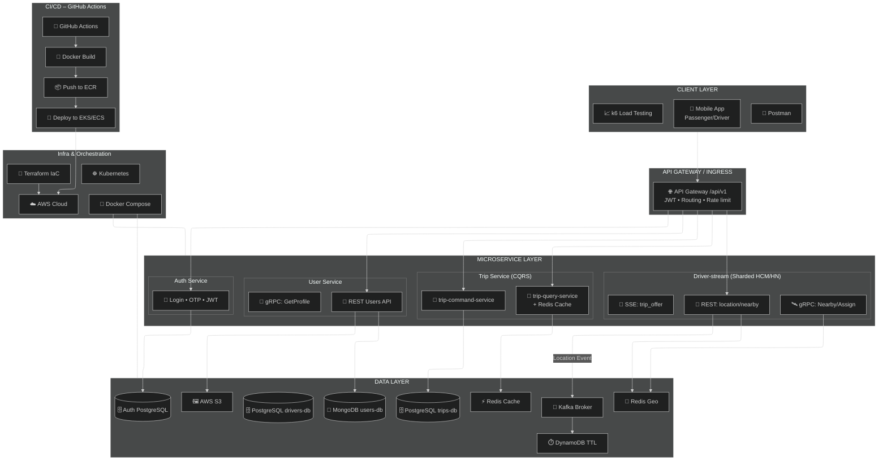

# UITGo – System Architecture Overview

UITGo là một hệ thống đặt xe thời gian thực (real-time ride-hailing platform), được thiết kế dựa trên kiến trúc **microservices** nhằm đáp ứng ba mục tiêu cốt lõi: **khả năng mở rộng (scalability)**, **độ trễ thấp (low latency)** và **tính tách biệt domain (domain isolation)**.
Mỗi service được triển khai như một bounded context độc lập, vừa tối ưu cho từng chức năng, vừa duy trì sự linh hoạt khi mở rộng trong tương lai.

## 1. Tổng quan kiến trúc hệ thống

Trung tâm của toàn bộ hệ thống là một **API Gateway** – cổng vào hợp nhất cho toàn bộ traffic từ client apps (mobile/web). Gateway xử lý xác thực JWT, chuẩn hóa metadata của request (như `X-User-Id`, `X-User-Role`), sau đó định tuyến đến microservice tương ứng.

### Luồng request tổng quát

```
Client (Mobile/Web)
    ↓
API Gateway (gateway-service:3004)
    ↓ (JWT verification, routing)
    ├──→ auth-service (port 3000) - Authentication
    ├──→ user-service (port 3001) - User profile (MongoDB)
    ├──→ trip-command-service (port 3002) - Trip write (PostgreSQL)
    ├──→ trip-query-service (port 3003) - Trip read (PostgreSQL + Redis cache)
    └──→ driver-stream (ports 8081/8082) - Driver location/status (Redis Geo + Kafka)
```

### Sơ đồ kiến trúc tổng quan



### 1.1 Hạ tầng cốt lõi

UITGo kết hợp nhiều công nghệ chuyên biệt nhằm tối ưu latency và throughput:

- **PostgreSQL** (port 5432): Database chính cho trip data, được tách biệt giữa command (PRIMARY_DB_URL) và query (READ_DB_URL) theo CQRS – đảm bảo consistency và transactional safety cho các thao tác trip write
- **MongoDB** (port 27017): Database cho user profile data với schema linh hoạt
- **Redis** (port 6379): 
  - Redis Geo → query tài xế trong bán kính theo thời gian thực
  - Redis Cache cho Trip data (trip-query-service) → tăng tốc trip reads
  - Redis TTL-state → ephemeral assignment state
- **Kafka** (ports 9092, 29092): Message broker cho event streaming (driver location updates)
- **OSRM** (port 5000): Routing engine để tính toán khoảng cách và thời gian di chuyển

### 1.2 Các pattern đã áp dụng

1. **Microservices Architecture**: Mỗi service độc lập, có thể deploy và scale riêng
2. **Database-per-Service**: Mỗi service có database riêng (PostgreSQL cho trip, MongoDB cho user)
3. **API Gateway Pattern**: Gateway đóng vai trò single entry point, xử lý authentication và routing
4. **CQRS (Command Query Responsibility Segregation)**: Trip service được tách thành command (write) và query (read)
5. **Event-Driven Architecture**: Sử dụng Kafka để publish driver location events
6. **Caching Strategy**: Redis cache cho read-path để giảm latency
7. **Sharding**: Driver-stream được shard theo region (HCM, HN)

## 2. Kiến trúc chi tiết Module A

Module này thể hiện rõ nhất **“nhịp đập thời gian thực”** của UITGo – từ khoảnh khắc hành khách tạo chuyến đến lúc hệ thống tìm tài xế phù hợp.

### 2.1. Luồng đặt chuyến & tìm tài xế (Create Trip + Find Driver)

**Flow chi tiết:**

1. **Client → Gateway**: 
   - Client gửi `POST /api/v1/trips` với body chứa `origin`, `destination`, `cityCode`
   - Gateway (`gateway-service/src/trips-proxy.controller.ts`) verify JWT token
   - Gateway extract `userId` và `role` từ JWT, gắn vào headers `X-User-Id`, `X-User-Role`
   - Gateway route request đến `trip-command-service`

2. **trip-command-service.create()** (`trip-service/trip-command-service/src/trips/trips.service.ts`):
   - **Verify user**: Gọi gRPC `GetProfile` đến `user-service` để verify user có role `PASSENGER`
   - **Tính fare**: Gọi OSRM hoặc sử dụng fake calculation để tính `quoteDistanceKm`, `quoteDurationMin`, `quoteFareTotal`
   - **Lưu trip**: Tạo record trong PostgreSQL `Trip` table với:
     - `status = 'DRIVER_SEARCHING'`
     - `cityCode = dto.cityCode ?? 'HCM'` (lưu city code để routing)
   - **Chọn shard driver-stream**: Sử dụng `getDriverStreamUrl(trip.cityCode)` từ `region-shard.config.ts`:
     - `cityCode = "HCM"` → `http://driver-stream-hcm:8080`
     - `cityCode = "HN"` → `http://driver-stream-hn:8080`
   - **GetNearbyDrivers**: HTTP GET `${driverStreamBaseUrl}/v1/drivers/nearby?lat=...&lng=...&radius=3000&limit=20`
     - `driver-stream` sử dụng Redis Geo (`GEORADIUS`) để tìm tài xế trong bán kính 3km
   - **PrepareAssign**: HTTP POST `${driverStreamBaseUrl}/v1/assign/prepare` với `tripId`, `candidates`, `ttlSeconds: 15`
     - `driver-stream` lưu candidates vào Redis và push SSE event đến các driver candidates
   - **Lưu assignments**: Tạo records trong `TripAssignment` table
   - **Emit event**: Tạo `TripEvent` và emit SSE event

3. **driver-stream xử lý**:
   - **Redis Geo**: Sử dụng `GEOADD` để lưu driver location vào set `geo:drivers`
   - **Nearby search**: Sử dụng `GEORADIUS` để tìm tài xế trong bán kính, filter chỉ lấy drivers có `status = "ONLINE"`
   - **PrepareAssign**: Lưu candidates vào Redis sets với TTL, push SSE event

**Đặc điểm:**
- Latency-sensitive: Cần tìm tài xế nhanh (< 200ms)
- Read-heavy: Nhiều requests đọc trip details
- Sử dụng Redis Geo để tối ưu spatial queries

### 2.2. Luồng cập nhật vị trí tài xế (Driver Location Update)

**Flow chi tiết:**

1. **Client → Gateway**:
   - Driver app gửi `PUT /api/v1/drivers/:id/location` với body chứa `lat`, `lng`, `speed`, `heading`
   - Gateway route đến `driver-stream` (có thể route đến shard tương ứng nếu cần)

2. **driver-stream xử lý** (`driver-stream/internal/http/server.go`):
   - **Update Redis Geo**: Gọi `Store.UpsertLocation()`:
     - `GEOADD geo:drivers <lng> <lat> <driverId>` - Update location trong Redis Geo set
     - `HSET presence:driver:{id} lat <lat> lng <lng> speed <speed> heading <heading> last_seen <timestamp>` - Update metadata
     - Set TTL 60s cho presence key
   - **Publish Kafka**: Publish event vào topic `driver.location.{region}` (HCM hoặc HN):
     ```json
     {
       "event": "driver.location",
       "driverId": "...",
       "lat": 10.8231,
       "lng": 106.6297,
       "speed": 45,
       "heading": 90,
       "ts": 1234567890
     }
     ```

**Đặc điểm:**
- Write-heavy: Nhiều location updates mỗi giây (mỗi driver update mỗi 1-5 giây)
- Throughput-sensitive: Cần xử lý nhanh (< 50ms)
- Event-driven: Publish events để các service khác có thể subscribe

## 3. CQRS cho Trip

### 3.1. Tách biệt Command và Query

**trip-command-service (Write Side):**
- Xử lý các operations: `create()`, `accept()`, `cancel()`, `rate()`, `arrive()`, `start()`, `finish()`
- Sử dụng `PRIMARY_DB_URL` environment variable
- Không sử dụng cache (cần consistency)
- Gọi `driver-stream` để tìm tài xế và quản lý assignment

**trip-query-service (Read Side):**
- Xử lý các operations: `getTripById()`, `getUserTrips()`
- Sử dụng `READ_DB_URL` environment variable (trong production có thể là read replica)
- Sử dụng Redis cache để tối ưu hiệu năng

### 3.2. Redis Cache Strategy

Trong `trip-query-service/src/trips/trips.service.ts.getTripById()`:

1. **Cache key**: `trip:{tripId}`
2. **Cache hit**: Nếu có data trong Redis, parse JSON và return ngay (không query database)
3. **Cache miss**: Query Postgres với `include: { rating, events }`, sau đó set cache với TTL 60s
4. **Error handling**: Nếu Redis fail, fallback về database query (không fail request)

**Lợi ích:**
- Giảm latency: Cache hit < 10ms vs database query ~50-100ms
- Giảm tải database: Đọc từ cache thay vì query database
- Tự động expire: TTL 60s đảm bảo data không quá cũ

## 4. Sharding driver-stream theo region/city

### 4.1. Cấu hình REGION_SHARD_CONFIG

File `trip-service/trip-command-service/src/config/region-shard.config.ts`:

```typescript
export const REGION_SHARD_CONFIG = {
  HCM: {
    driverStreamBaseUrl: process.env.DRIVER_STREAM_HCM_URL || 'http://driver-stream-hcm:8080',
  },
  HN: {
    driverStreamBaseUrl: process.env.DRIVER_STREAM_HN_URL || 'http://driver-stream-hn:8080',
  },
};
```

### 4.2. Multi-container Deployment

| Shard | Redis DB Index | Kafka Topic         | gRPC Port |
|:-----:|:--------------:|:-------------------:|:---------:|
|  HCM  |       0        | driver.location.hcm |   50052   |
|  HN   |       1        | driver.location.hn  |   50053   |

Docker Compose định nghĩa 2 services:

- **driver-stream-hcm**:
  - Container name: `driver-stream-hcm`
  - Port: 8081 (host) → 8080 (container)
  - Redis: DB index 0 (`redis://redis:6379/0`)
  - Kafka topic: `driver.location.hcm`
  - gRPC port: 50052

- **driver-stream-hn**:
  - Container name: `driver-stream-hn`
  - Port: 8082 (host) → 8080 (container)
  - Redis: DB index 1 (`redis://redis:6379/1`)
  - Kafka topic: `driver.location.hn`
  - gRPC port: 50053

### 4.3. Routing Logic

Trong `trips.service.ts.create()`:
1. Lưu `cityCode` vào `Trip.cityCode` (từ request body hoặc default "HCM")
2. Gọi `getDriverStreamUrl(trip.cityCode)` để lấy base URL tương ứng
3. Gọi HTTP requests đến shard tương ứng:
   - `GET ${baseUrl}/v1/drivers/nearby`
   - `POST ${baseUrl}/v1/assign/prepare`

**Lợi ích:**
- Scale theo địa lý: Mỗi region có thể scale độc lập
- Giảm latency: Tài xế HCM không cần query tài xế HN
- Isolation: Lỗi ở một region không ảnh hưởng region khác

## 5. Sử dụng Redis, Kafka, k6

### 5.1. Redis Geo trong driver-stream

**Implementation** (`driver-stream/internal/redis/store.go`):

- **UpsertLocation**: Sử dụng `GEOADD` để thêm/update location vào Redis Geo set `geo:drivers`
- **Nearby**: Sử dụng `GEORADIUS` để tìm tài xế trong bán kính:
  ```go
  s.Rdb.GeoRadius(ctx, geoKey, lng, lat, &redis.GeoRadiusQuery{
    Radius: float64(radius),  // meters
    Unit: "m",
    WithDist: true,
    WithCoord: true,
    Count: limit,
    Sort: "ASC",
  })
  ```
  Sau đó filter chỉ lấy drivers có `status = "ONLINE"` từ Redis hash `presence:driver:{id}`

**Lợi ích:**
- Hiệu năng cao: Redis Geo tối ưu cho spatial queries, nhanh hơn query database quan hệ
- Real-time: Location được update liên tục, không cần query database

### 5.2. Redis Cache trong trip-query-service

**Implementation** (`trip-service/trip-query-service/src/common/redis.service.ts`):

- **Key format**: `trip:{tripId}`
- **TTL**: 60 seconds
- **Value**: JSON string của Trip object (bao gồm rating, events)
- **Hit/Miss flow**: Check Redis → Parse JSON nếu hit → Query Postgres nếu miss → Set cache

**Lợi ích:**
- Giảm latency: Cache hit < 10ms vs database query ~50-100ms
- Giảm tải database: Đọc từ cache thay vì query database

### 5.3. Kafka cho Event Streaming

**Implementation** (`driver-stream/internal/kafka/producer.go`):

- **Topic**: `driver.location.{region}` (HCM hoặc HN)
- **Producer**: Publish location updates với key là `driverId`
- **Payload**: JSON chứa `driverId`, `lat`, `lng`, `speed`, `heading`, `ts`

**Lợi ích:**
- Decoupling: Các service khác có thể subscribe để xử lý events
- Scalability: Kafka hỗ trợ multiple consumers
- Durability: Events được lưu trữ, có thể replay

### 5.4. k6 Load Testing

**Scripts trong `infra/k6/`:**

1. **trips_create.js**: Test latency của create trip flow
   - VUs: 30, Duration: 1m
   - Threshold: `p(95)<200ms`
   - Mục tiêu: Đo latency từ gateway → trip-command → driver-stream → Redis Geo

2. **drivers_update_location.js**: Test throughput của location updates
   - VUs: 50, Duration: 1m
   - Threshold: `p(95)<50ms`
   - Mục tiêu: Đo throughput của location update (driver-stream → Redis Geo → Kafka)

3. **trips_read_cached.js**: Test read-heavy scenario với cache
   - VUs: 50, Duration: 1m
   - Threshold: `p(95)<100ms` (với cache)
   - Mục tiêu: Đo hiệu quả của Redis cache

**Lợi ích:**
- Đánh giá hiệu năng: Xác định bottlenecks và tối ưu
- Verify SLA: Đảm bảo hệ thống đáp ứng yêu cầu latency/throughput

## Sơ đồ luồng (Text-based)

### Create Trip Flow

```
Client
  ↓ POST /api/v1/trips
Gateway (JWT verify, route)
  ↓ POST /v1/trips (X-User-Id, X-User-Role)
trip-command-service
  ↓ gRPC GetProfile
user-service
  ↓ (verify PASSENGER role)
trip-command-service
  ↓ Calculate fare (OSRM)
  ↓ Save Trip to PostgreSQL (cityCode)
  ↓ getDriverStreamUrl(cityCode)
  ↓ HTTP GET /v1/drivers/nearby
driver-stream-{region}
  ↓ Redis Geo GEORADIUS
Redis
  ↓ (return nearby drivers)
driver-stream-{region}
  ↓ HTTP POST /v1/assign/prepare
  ↓ Redis SET candidates + SSE push
  ↓ (return candidates)
trip-command-service
  ↓ Save TripAssignment
  ↓ Emit SSE event
  ↓ (return tripId)
Gateway
  ↓ (return response)
Client
```

### Driver Location Update Flow

```
Driver App
  ↓ PUT /api/v1/drivers/:id/location
Gateway
  ↓ PUT /v1/drivers/:id/location
driver-stream-{region}
  ↓ Store.UpsertLocation()
  ↓ GEOADD geo:drivers
  ↓ HSET presence:driver:{id}
Redis
  ↓ (location updated)
driver-stream-{region}
  ↓ Producer.PublishDriverLocation()
Kafka (topic: driver.location.{region})
  ↓ (event published)
  ↓ (return 202 Accepted)
Gateway
  ↓ (return response)
Driver App
```

